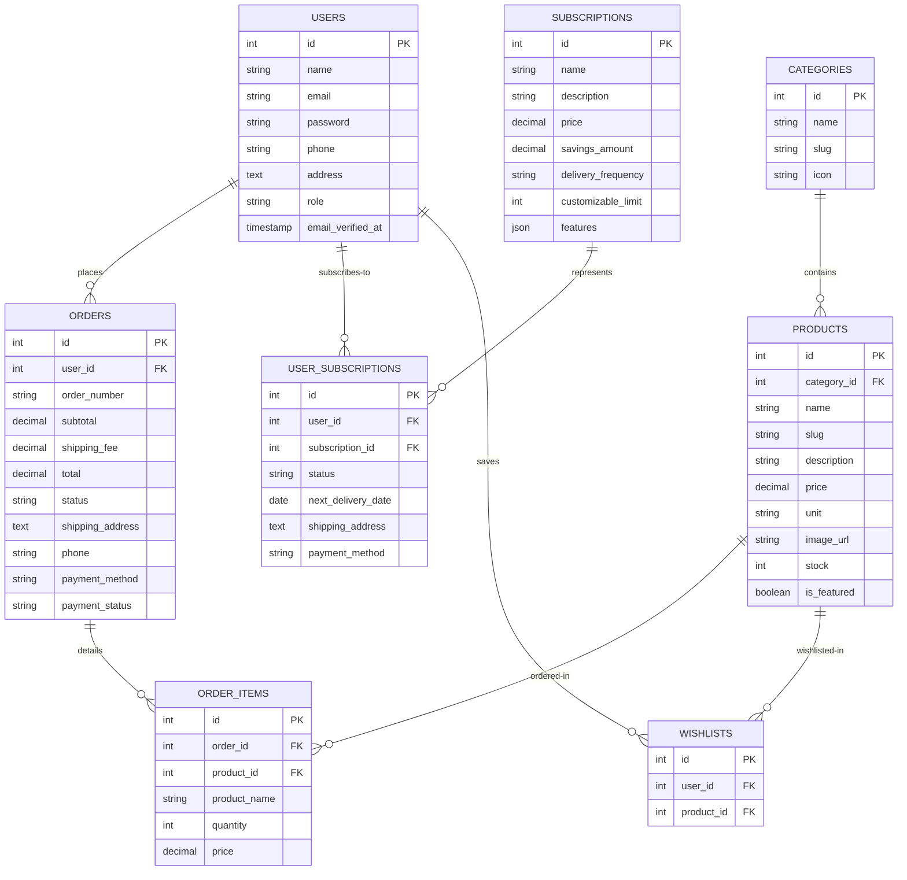
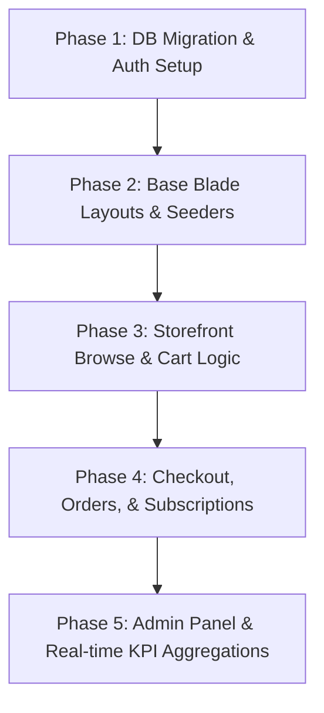

# Supermarket@Home: Prototype Integration Plan

This integration plan describes how to port the **20 static HTML prototype pages** in the [prototype_gemini](file:///C:/Users/tunde/Herd/supermarket/prototype_gemini) directory into a dynamic, fully functioning Laravel e-commerce application.

---

## 1. Architectural Overview

The application will be divided into three primary sections:

1. **Public/E-Commerce Storefront**: Browsing products, managing a session-based cart, viewing subscription food baskets, checkout process, and static information pages (About, FAQ, Contact).
2. **Customer Portal**: Account management, order history details, subscription management, and wishlist. Protected by standard `auth` middleware.
3. **Admin Panel**: Management of orders, inventory products catalog, customer database, and subscription plans. Protected by `auth` and an `admin` role check.

### Page and Route Mapping Matrix

Below is a map of the static files in `prototype_gemini` and how they correspond to Laravel routes, controllers, and views.

| Static Prototype File      | Target URL Route       | Controller & Action                            | Target Blade View Path                | Access Level |
| :------------------------- | :--------------------- | :--------------------------------------------- | :------------------------------------ | :----------- |
| `index.html`               | `/`                    | `HomeController@index`                         | `home.blade.php`                      | Public       |
| `about.html`               | `/about`               | `HomeController@about`                         | `about.blade.php`                     | Public       |
| `contact.html`             | `/contact`             | `HomeController@contact`                       | `contact.blade.php`                   | Public       |
| `faq.html`                 | `/faq`                 | `HomeController@faq`                           | `faq.blade.php`                       | Public       |
| `products.html`            | `/products`            | `ProductController@index`                      | `products.index.blade.php`            | Public       |
| `product-details.html`     | `/products/{slug}`     | `ProductController@show`                       | `products.show.blade.php`             | Public       |
| `cart.html`                | `/cart`                | `CartController@index`                         | `cart.index.blade.php`                | Public       |
| `checkout.html`            | `/checkout`            | `CheckoutController@index`                     | `checkout.index.blade.php`            | Auth-only    |
| `subscriptions.html`       | `/subscriptions`       | `SubscriptionController@index`                 | `subscriptions.index.blade.php`       | Public       |
| `login.html`               | `/login`               | `Auth\LoginController@showLoginForm`           | `auth.login.blade.php`                | Guest-only   |
| `register.html`            | `/register`            | `Auth\RegisterController@showRegistrationForm` | `auth.register.blade.php`             | Guest-only   |
| `dashboard.html`           | `/dashboard`           | `DashboardController@index`                    | `dashboard.index.blade.php`           | Auth-only    |
| `profile.html`             | `/profile`             | `ProfileController@edit`                       | `profile.edit.blade.php`              | Auth-only    |
| `orders.html`              | `/orders`              | `OrderController@index`                        | `orders.index.blade.php`              | Auth-only    |
| `wishlist.html`            | `/wishlist`            | `WishlistController@index`                     | `wishlist.index.blade.php`            | Auth-only    |
| `admin-dashboard.html`     | `/admin`               | `Admin\DashboardController@index`              | `admin.dashboard.blade.php`           | Admin-only   |
| `admin-orders.html`        | `/admin/orders`        | `Admin\OrderController@index`                  | `admin.orders.index.blade.php`        | Admin-only   |
| `admin-products.html`      | `/admin/products`      | `Admin\ProductController@index`                | `admin.products.index.blade.php`      | Admin-only   |
| `admin-subscriptions.html` | `/admin/subscriptions` | `Admin\SubscriptionController@index`           | `admin.subscriptions.index.blade.php` | Admin-only   |
| `admin-customers.html`     | `/admin/customers`     | `Admin\CustomerController@index`               | `admin.customers.index.blade.php`     | Admin-only   |

---

## 2. Database Design & Relationships

To support these features, we require a database schema managing products, orders, cart items, wishlists, and recurring food basket subscriptions.

### Database Schema Entity-Relationship

---

## 3. Blade Templates & Shared Layout Layouts

To avoid code duplication across the 20 files, we will implement three primary Blade layouts:

1. **`layouts/app.blade.php`**: Includes the public global stylesheet, Google fonts link, top announcement bar, header search components, cart counter badge, and footer links. Used by all storefront pages.
2. **`layouts/auth.blade.php`**: Tailored for `login.blade.php` and `register.blade.php` with simplified headers to reduce friction during onboarding.
3. **`layouts/admin.blade.php`**: Includes the dark vertical admin navigation sidebar, search/notification top header, and page wrapper. Used by all admin panels.

### Blade Component Division

To make pages modular, several sections of the static HTML will be extracted into components:

- **`components/product-card.blade.php`**: The grid layout component displaying image, badge, name, price, unit, and "Add to Cart" button (reused on the home page and category browse pages).
- **`components/admin/sidebar.blade.php`**: The navigation sidebar for admin views.
- **`components/admin/metric-card.blade.php`**: The colored stat widgets representing revenue, order volume, subscription status, etc.

---

## 4. Implementation Steps

We will execute the implementation in **five distinct phases** to ensure a logical workflow and code correctness.

### Phase 1: Database Migration & Core Auth

- **Migration & Model Creation**:
  Create models and database migration files for:
    - Categories, Products, Subscriptions
    - Orders, OrderItems, UserSubscriptions, Wishlists
    - Extend the default `users` migration to add `phone`, `address`, and `role`.
- **Auth Layer Setup**:
    - Implement Custom Authentication Controllers using Laravel default Session Guard.
    - Port `login.html` and `register.html` static codes into Laravel Blade layout views (`auth.login` and `auth.register`).

### Phase 2: Base Blade Layouts & Seeders

- **Layout Setup**:
  Create `layouts/app.blade.php` (frontend storefront layout) and `layouts/admin.blade.php` (admin view sidebar layout) containing the scripts, fonts, and assets extracted from the prototype files.
- **Seeders**:
  Create seeders to populate initial data:
    - Categorized supermarket goods (Roma Tomatoes, Basmati Rice, Eggs, Dairy, beverages).
    - Pre-defined Subscription Food Baskets (Starter, Family, Premium) matching prices and savings in prototype.
    - A default administrative user account (`admin@supermarket.com`) and regular customer account (`user@supermarket.com`) for testing.

### Phase 3: Storefront Catalog, Search & Cart

- **Homepage & Static Views**:
  Convert `index.html`, `about.html`, `contact.html`, and `faq.html` to blade files. Dynamically load featured products and categories on the homepage.
- **Product Index & Search**:
  Implement search matching terms from the query input and category filter toggles in `ProductController@index`.
- **Session-Based Cart**:
  Implement session cart endpoints (`/cart/add`, `/cart/update`, `/cart/remove`) and display updated item counts on the header cart count badge.

### Phase 4: Checkout, Orders & Subscriptions

- **Checkout Flow**:
  Ensure user is authenticated before checking out. Map standard shipping addresses and submit orders.
- **Subscription Checkout**:
  Build endpoints supporting subscribing to monthly plans, saving selection to `user_subscriptions` DB table.
- **User Portal Portal**:
  Convert `dashboard.html`, `profile.html`, `orders.html`, and `wishlist.html` to Blade, showing current logged-in user details, order invoice history, active subscription statuses, and saved wishlist products.

### Phase 5: Admin Dashboard Controllers

- **Dashboard Metrics**:
  Calculate real database values for:
    - Total sales revenues
    - Today's order volumes
    - Active subscription plans counts
    - Low-stock inventory alert items
- **Inventory CRUD Management**:
  Support full dynamic creation, updates, and deletion of products, including image uploads and categorizations.
- **Orders & Subscriptions Lists**:
  Display comprehensive tabular panels tracking all client purchases and subscription active lists.

---

## 5. Next Actions & Feedback Requested

Before proceeding with the implementation of the plan, we would like to align on these decisions:

1. **Frontend Asset Strategy**: Should we continue using Tailwind CSS via the CDN as in the prototype, or compile it locally via Vite and Tailwind CSS configuration? Using Vite is recommended for production performance, but the CDN is faster for a quick, self-contained prototype setup.
2. **Authentication Starter Kit**: Would you prefer using Laravel's standard Breeze starter kit (blade-based) for standard auth pages and dashboard framework, or should we write simple custom controllers from scratch to match the exact custom visual forms in `login.html`/`register.html`?
3. **Mock Payments**: For Checkout and Subscriptions, should we implement a mock gateway (e.g., simulating Paystack/Flutterwave payments, which are popular in Nigeria where ₦ is used) or keep it simple with "Cash on Delivery" or instant success redirects?
